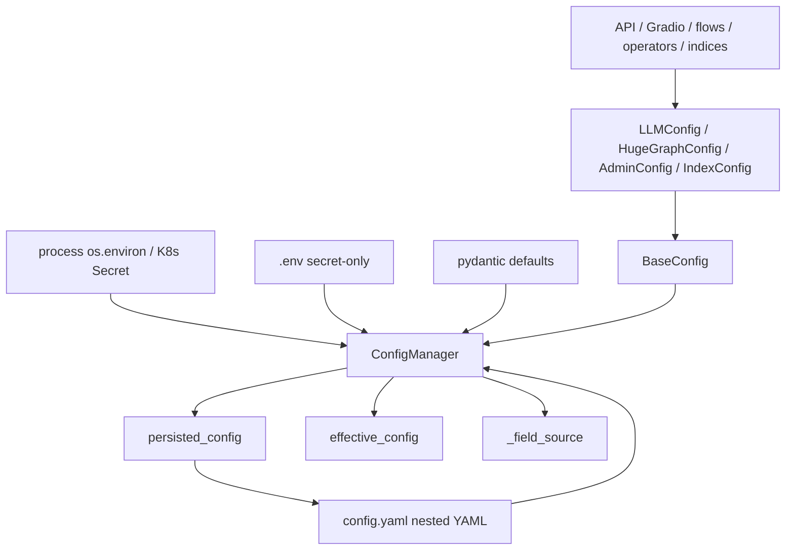

# Graph-AI 配置存储重构方案 V5.1 单文件计划

## 0. 来源与定位

本计划以飞书 Wiki《Graph-AI的配置存储重构方案V》（revision 131）和 26 条未解决修改意见为准，用于替代旧版 `.workflow/yaml-config-migration` 中按 `requirements.md` / `design.md` / `tasks.md` 拆分的计划。

关联 Issue: https://github.com/apache/hugegraph-ai/issues/234

核心结论：

- `.env` 不废弃，重新定义为 secret-only 文件。
- V1 只交付核心配置闭环：嵌套 `config.yaml`、四层优先级、secret 不落盘、patch-only 写盘、no CWD fallback、基础迁移、必要测试 gate。
- PromptConfig 全生命周期、API/operator 默认值全面审计、部署 grep gate、完整 rollback 工具、hot reload 拆到 V1.1/V2。
- 旧计划里的 hot-reload、全量 `model_dump()` 写回、`.env` 一次性废弃不再作为 V1 方向。

## 1. 修改意见采纳摘要

| 修改意见 | 处理方式 |
|---|---|
| `.env` 迁移需要敏感字段分类 | V1 hard gate，非敏感进 YAML，敏感保留 `.env` / Secret |
| `.env` 应继续作为 secret-only 来源 | V1 hard gate，四层优先级改为 process env > `.env` > YAML > default |
| 非 LLM 配置也要完整 `_env_var_map` | V1 hard gate，HugeGraph/Admin/Index 全部纳入 |
| `update_config()` 不能靠 key 数量判断 full dump | V1 hard gate，使用 leaf-shape + allowlist |
| `update_env()` wrapper 不能继续 dump 当前 settings | V1 hard gate，deprecated wrapper 必须安全 |
| source tracking key 要统一 | V1 hard gate，统一使用 global dotted leaf path |
| sensitive YAML placeholder 需要明确 | V1 hard gate，示例可 `null`，真实保存不得写非空 secret |
| Phase2 YAML + `.env` 共存需要矩阵 | V1 hard gate，known sensitive 生效，known non-sensitive 只 warning |
| import-time 不得直接读 env | V1 hard gate，配置模型默认值禁止 env 读取 |
| 迁移失败/回滚状态机要清晰 | V1 做基础备份和失败不写盘，完整 rollback CLI 放 V2 |
| CI 不要依赖 `-k` 关键词过滤 | V1 hard gate，显式测试文件或 marker |
| V1 范围过大 | 已收敛为 V1 hard gate / V1.1-V2 follow-up |
| PromptConfig 生命周期需要唯一决策 | 放 V1.1，先做架构取舍 |
| API/operator 默认值审计 | 放 V1.1，作为消费者矩阵 |
| `configs_block.py` role 级联 | 放 V1.1，使用 source tracking |
| 部署文档和 grep gate | 放 V1.1 |
| Markdown + JSON 迁移报告 | 放 V2 |
| hot reload | 放后续独立设计 |

## 2. V1 需求

### 2.1 嵌套语义化 `config.yaml`

- `config.yaml` 使用 `llm`、`hugegraph`、`admin`、`index` 作为顶层语义节。
- YAML 用户可见 key 使用小写自然嵌套。
- pydantic 模型继续保留 flat field，保持 Python 属性访问兼容。
- 每个配置类必须声明：
  - `_config_section`
  - `_flat_to_nested_mapping`
  - `_env_var_map`
  - `_mutable_persisted_fields`
- `_flat_to_nested_mapping` 必须覆盖所有模型字段，未映射字段必须被显式归类，否则 CI fail。

### 2.2 `.env` secret-only 语义

四层优先级：

```text
process os.environ / K8s Secret
  > .env secret-only
  > config.yaml
  > pydantic default
```

规则：

- `.env` loader 使用 `override=False`，不能覆盖已存在 process env。
- `.env` 中 known sensitive key 参与 effective override。
- `.env` 中 known non-sensitive legacy key 只 warning/report，不覆盖 YAML。
- unknown sensitive-like key 进入 report，不自动生效。
- unknown non-sensitive key 进入 `_migration_unknown` 或 report，不自动生效。

敏感字段判定：

- 字段名或 path 含 `api_key`、`token`、`password`、`pwd`、`secret`。
- 支持显式 sensitive allowlist，如 `OPENAI_API_KEY`、`GRAPH_PWD`、`ADMIN_TOKEN`、`USER_TOKEN`、`QDRANT_API_KEY`、`MILVUS_PASSWORD`。

### 2.3 Secret 不落盘

必须维护两层配置：

| 层 | 来源 | 可写盘 | 用途 |
|---|---|---|---|
| `persisted_config` | YAML + explicit persisted patch | 是 | 非敏感声明式配置 |
| `effective_config` | defaults + YAML + `.env` + process env | 否 | 运行时生效值 |

不变式：

- `save()` 只序列化 `persisted_config`。
- `effective_config` 永远不 full dump 到 YAML。
- `.env` / process env / K8s Secret 来源字段永不写入 YAML。
- 日志、错误、diff、迁移报告、`check_config()` 中 sensitive value 必须脱敏。

Sensitive YAML representation policy：

- 示例文件可以保留 sensitive leaf 的 `null` placeholder。
- 真实 `save()` 必须省略 sensitive path 或只写 `null`。
- `update_config()` 必须拒绝任何 sensitive path 的非空写入。

### 2.4 字段来源追踪

`_field_source` 内部 key 统一使用 global dotted leaf path，例如 `llm.openai.chat.api_key`。

来源类型：

```python
FieldSource = Literal[
    "yaml_persisted",
    "migrated_persisted",
    "explicit_persisted_patch",
    "effective_default",
    "dotenv_secret",
    "process_env_override",
    "runtime_only_patch",
]
```

### 2.5 Patch-only 写盘 API

`BaseConfig.update_config(patch)`：

- 只接受 section-local flat leaf patch。
- 示例：`{"openai_chat_language_model": "gpt-4.1"}`
- 不接受 dotted path、nested mapping、section object、full dump。

`ConfigManager.update_config(patch)`：

- 只接受 global dotted leaf patch。
- 示例：`{"llm.openai.chat.language_model": "gpt-4.1"}`
- allowlist 由 `_mutable_persisted_fields` + `_flat_to_nested_mapping` 机械生成。

拒绝规则：

- patch value 是 dict / object / section payload。
- path 是 unknown path。
- path 是 metadata key，如 `_field_source`、`_persisted_cfg`。
- path 是 sensitive path。
- patch 是 full model dump、section dump 或 effective dump。
- 旧模式 `setattr(settings, ...) + update_env()` 不能作为写盘路径继续存在。

Deprecated wrapper：

- `update_env()`、`generate_env()`、`check_env()` 保留但发出 `DeprecationWarning`。
- wrapper 不得无参 dump 当前 effective settings。
- wrapper 不得把 env secret 写进 YAML。

### 2.6 自动迁移

支持三种格式：

| Phase | 来源 | 特征 |
|---|---|---|
| Phase0 | `.env` | ALL_CAPS flat key |
| Phase1 | `config.yaml` | 类名节名 + ALL_CAPS 或 flat key |
| Phase2 | `config.yaml` | `llm` / `hugegraph` / `admin` / `index` nested key |

迁移规则：

- 仅 Phase0 `.env`：非敏感字段写入 nested `config.yaml`，敏感字段保留 `.env`。
- 仅 Phase1 flat YAML：迁移为 nested YAML，sensitive value 移除或置 `null`。
- Phase2 YAML 已存在：直接加载 YAML，`.env` 仅作为 secret-only override。
- Phase1 YAML + `.env` 共存：YAML 是非敏感配置主来源，`.env` 是 secret 来源，输出 diff warning/report。
- unknown legacy key 写入 `_migration_unknown` 或 report，不散落 YAML 顶层。

迁移安全：

- 使用 `model_validate()` / `TypeAdapter` 做无副作用验证。
- 不复用会触发 ConfigManager 初始化、env override 或 YAML 写回的构造路径。
- 写盘使用 temp file + atomic rename。
- 校验失败不生成或覆盖 `config.yaml`，保留原 `.env`。
- `.env.bak` / `config.yaml.bak` 权限限制为 `0600`。
- 迁移日志和报告脱敏。

### 2.7 路径与启动副作用

config base dir 解析顺序：

1. `HUGEGRAPH_LLM_CONFIG_DIR`
2. `HUGEGRAPH_AI_CONFIG_DIR`，兼容过渡并 warning
3. 模块锚定默认目录

规则：

- 禁止 fallback 到 `os.getcwd()`。
- 改变启动目录不得改变配置解析结果。
- 配置模型字段默认值不得 import-time 读取 `os.environ` / `getenv` / `.env`。
- env 读取只能出现在 ConfigManager / secret resolver / migration adapter 中。
- 已有配置文件可读时，只读目录导入不得因为自动写盘失败而污染文件。

## 3. V1 技术设计

### 3.1 组件关系



### 3.2 加载流程

```text
resolve config base dir
  -> detect Phase2 YAML / Phase1 YAML / Phase0 .env
  -> load or migrate persisted_config
  -> read .env as secret-only, override=False
  -> merge defaults + YAML + .env secrets + process env
  -> validate effective_config
  -> expose pydantic config objects
```

### 3.3 写盘流程

```text
BaseConfig.update_config(section-local flat patch)
  -> convert to global dotted leaf patch
  -> validate leaf-only shape
  -> reject metadata / sensitive / unknown / full dump
  -> apply explicit_persisted_patch to persisted_config
  -> save persisted_config only
```

### 3.4 Phase2 YAML + `.env` 决策矩阵

| 输入 key 类型 | 来源 | 行为 |
|---|---|---|
| known sensitive | process env | 最高优先级 effective override，不持久化 |
| known sensitive | `.env` | effective override，不持久化 |
| known sensitive | YAML | 只允许 `null` 或缺省；非空迁移/保存时移除或置空 |
| known non-sensitive | process env | 允许 runtime override |
| known non-sensitive | `.env` | warning/report，不覆盖 YAML |
| known non-sensitive | YAML | persisted config 主来源 |
| unknown sensitive-like | `.env` / legacy | 进入 report，不自动生效 |
| unknown non-sensitive | `.env` / legacy | 进入 `_migration_unknown` 或 report，不自动生效 |

### 3.5 示例配置

`config.yaml`：

```yaml
llm:
  language: CN
  chat_llm_type: openai
  openai:
    chat:
      api_base: https://api.openai.com/v1
      api_key: null
      language_model: gpt-4.1-mini
      tokens: 8192

hugegraph:
  graph:
    url: 127.0.0.1:8080
    name: hugegraph
    user: admin
    pwd: null

admin:
  login:
    enable: "False"
    admin_token: null
    user_token: null

index:
  cur_vector_index: Faiss
  qdrant:
    host: 127.0.0.1
    port: 6333
    api_key: null
```

`.env`：

```bash
OPENAI_API_KEY=sk-xxxxxxxx
GRAPH_PWD=my-graph-password
ADMIN_TOKEN=my-admin-token
USER_TOKEN=my-user-token
QDRANT_API_KEY=my-qdrant-key
MILVUS_PASSWORD=my-milvus-password
```

## 4. V1 实现任务

- [ ] 1. **研究与基线审计** `[优先级: 高]`

  - [ ] 1.1. 搜索配置模块中的 env 直接读取和旧设置入口，确认 `os.environ|getenv|dotenv_values|set_key|env_file|BaseSettings|update_env|generate_env|check_env` 的所有命中位置。
  - [ ] 1.2. 盘点配置消费面，至少覆盖 `config/__init__.py`、`configs_block.py`、`config/generate.py`、API `/config/*` 写入口、flow/operator/index 构造默认值。
  - [ ] 1.3. 生成旧 env 名称全集，并按配置类归档到 LLM / HugeGraph / Admin / Index。
  - [ ] 1.4. 对比当前实现 diff 与飞书 V5.1 契约，列出已满足、需修改、应延后的项。

- [ ] 2. **TDD: 配置合同与安全测试** `[优先级: 高]`

  - [ ] 2.1. 增加四层优先级测试：process env > `.env` secret-only > YAML > default。
  - [ ] 2.2. 增加 secret 不落盘测试：`save()`、`update_config()`、迁移都不写 env secret。
  - [ ] 2.3. 增加 write-path audit 测试：拒绝 full dump、section dump、nested mapping、metadata key、unknown path、sensitive path、effective dump。
  - [ ] 2.4. 增加 migration 测试：Phase0 `.env`、Phase1 flat YAML、Phase2 nested YAML、YAML + `.env` 共存、unknown key、失败不写盘。
  - [ ] 2.5. 增加 mapping/env coverage 测试：`_flat_to_nested_mapping` 覆盖模型字段，`_env_var_map` 覆盖旧 env 名称全集。
  - [ ] 2.6. 增加 path/import 副作用测试：no CWD fallback、只读已有配置可读、配置模型默认值不 import-time 读取 env。

- [ ] 3. **ConfigManager 与路径基础设施** `[优先级: 高]`

  - [ ] 3.1. 实现/修正 `resolve_config_base_dir()`，移除 CWD fallback。
  - [ ] 3.2. 在 `ConfigManager` 中维护 `persisted_config` 与 `effective_config`。
  - [ ] 3.3. 实现 global dotted leaf path `_field_source`。
  - [ ] 3.4. 实现 `.env` secret-only loader，known sensitive 生效，known non-sensitive 只 warning/report。
  - [ ] 3.5. 使用 `TypeAdapter.validate_python()` 做 env 类型转换，失败 fail-fast。

- [ ] 4. **扁平字段与嵌套 YAML 映射** `[优先级: 高]`

  - [ ] 4.1. 实现/修正 `_flat_to_nested()` 与 `_nested_to_flat()`。
  - [ ] 4.2. 为 `LLMConfig` 补齐 provider x role 的 mapping、env map、mutable persisted fields。
  - [ ] 4.3. 为 `HugeGraphConfig` 补齐 mapping / env map / mutable persisted fields。
  - [ ] 4.4. 为 `AdminConfig` 补齐 mapping / env map / mutable persisted fields。
  - [ ] 4.5. 为 `IndexConfig` 补齐 mapping / env map / mutable persisted fields。
  - [ ] 4.6. 移除配置模型字段默认值中的 env 读取和 `BaseSettings` env-file 依赖。

- [ ] 5. **Patch-only 写盘 API** `[优先级: 高]`

  - [ ] 5.1. 实现 `BaseConfig.update_config(patch)`，只接受 section-local flat leaf patch。
  - [ ] 5.2. 实现 `ConfigManager.update_config(patch)`，只接受 global dotted leaf patch。
  - [ ] 5.3. 实现 allowlist 校验，使用 `mutable_persisted_leaf_paths` 作为唯一允许集合。
  - [ ] 5.4. 拒绝 nested mapping、section object、metadata key、unknown path、sensitive path、full dump、effective dump。
  - [ ] 5.5. 实现 sensitive YAML representation policy。
  - [ ] 5.6. 将 deprecated wrapper 改为安全 wrapper，不再 dump effective config。

- [ ] 6. **Legacy 迁移与备份安全** `[优先级: 高]`

  - [ ] 6.1. 实现 Phase0 / Phase1 / Phase2 检测。
  - [ ] 6.2. 实现 legacy 输入无副作用验证。
  - [ ] 6.3. 实现敏感字段分类迁移。
  - [ ] 6.4. 实现 unknown legacy key 处理。
  - [ ] 6.5. 实现 temp file + atomic rename。
  - [ ] 6.6. 实现 `.env.bak` / `config.yaml.bak` 权限、命名、脱敏日志。

- [ ] 7. **V1 消费者写入口收敛** `[优先级: 中]`

  - [ ] 7.1. 修改 Gradio `configs_block.py`，禁止 `setattr + update_env()` 写盘模式，改为显式 patch。
  - [ ] 7.2. 修改 `/config/*` API 写入口，区分 persisted patch 与 runtime-only patch。
  - [ ] 7.3. 保留属性读取兼容性，但写入必须通过 patch allowlist。
  - [ ] 7.4. 确认 request-scoped `client_config` 不污染全局 settings。

- [ ] 8. **示例、文档与 CI 最小闭环** `[优先级: 中]`

  - [ ] 8.1. 新增/更新 `hugegraph-llm/config.example.yaml`。
  - [ ] 8.2. 更新配置文档，说明 `.env` secret-only、Compose `.env` 与 secret `.env` 区别、hot reload 不在 V1。
  - [ ] 8.3. 更新 `.gitignore`，忽略 config、env、bak、迁移报告等敏感相关文件。
  - [ ] 8.4. 在 CI 中显式接入 config 测试文件或 marker。
  - [ ] 8.5. 运行 `SKIP_EXTERNAL_SERVICES=true uv run pytest hugegraph-llm/src/tests/config/ -v --tb=short`。
  - [ ] 8.6. 运行 root `uv run ruff format --check .` 和 `uv run ruff check .`。

## 5. V1.1 / V2 Follow-up

### 5.1 PromptConfig 生命周期

- [ ] 决定 `config_prompt.yaml` 唯一路线：用户可写同 base dir，或只读 package template fallback。
- [ ] 若选择用户可写，实现模板复制、同 base dir、只读目录策略。
- [ ] 若选择只读 fallback，实现只读运行和显式保存时才要求可写。
- [ ] 增加 prompt lifecycle 测试。

### 5.2 API / operator 默认值消费者矩阵

- [ ] 盘点 API request model 默认值、operator 构造默认值、node fallback literal、flow/index 构造参数、import-time path。
- [ ] 配置项默认值改为运行时 resolver 或显式注入。
- [ ] 非配置 literal 明确记录为非配置项。
- [ ] 修正 OpenAPI 动态默认值展示策略。

### 5.3 `configs_block.py` role 级联

- [ ] 将 chat -> extract/text2gql 级联判断从 `.env` 文件存在性切换为 `_field_source`。
- [ ] YAML / explicit persisted patch 来源不自动覆盖。
- [ ] default 来源可级联。
- [ ] dotenv/process secret 来源保护不覆盖。
- [ ] 增加 Gradio apply 回调测试。

### 5.4 部署文档与 grep gate

- [ ] 使用真实仓库路径更新 README、Docker、Helm、配置升级指南。
- [ ] 区分 secret `.env`、Compose `.env`、旧通用 `.env`。
- [ ] 增加 deploy grep 或 snapshot 测试，断言 secret 不进入 ConfigMap 或非敏感 YAML 示例。
- [ ] 明确 `docker/env.template` 只表示 Compose `PROJECT_PATH` 模板，不是 `config.yaml` 模板。

### 5.5 迁移报告与 rollback 工具

- [ ] 生成 Markdown + JSON 迁移报告。
- [ ] JSON 包含 `migration_id`、phase、config_base_dir、created_files、backup_files、sensitive_keys_retained、persisted_keys、unknown_keys。
- [ ] 实现 rollback 命令或脚本，按 `migration_id` 精确恢复本次迁移对应备份。
- [ ] 增加 rollback 测试。

### 5.6 Hot reload 独立设计

- [ ] 单独调研 reload 状态机、请求间隔离、错误回退、source tracking 更新策略。
- [ ] 另起需求/设计/任务文档，不混入当前 V1 配置迁移 hard gate。

## 6. V1 验收与 CI Gate

建议显式测试文件或 marker，不主要依赖 `-k` 关键词过滤。

```bash
SKIP_EXTERNAL_SERVICES=true uv run pytest \
  hugegraph-llm/src/tests/config/test_config_manager.py \
  hugegraph-llm/src/tests/config/test_config_migration.py \
  hugegraph-llm/src/tests/config/test_config_write_path_audit.py \
  hugegraph-llm/src/tests/config/test_config_mapping_audit.py \
  hugegraph-llm/src/tests/config/test_config_env_coverage.py \
  hugegraph-llm/src/tests/config/test_config_path_contract.py \
  -v --tb=short
```

若当前测试文件尚未拆分，可先用现有 `hugegraph-llm/src/tests/config/` 跑通，但最终 CI gate 应与实际文件名/marker 对齐。

同时运行：

```bash
uv run ruff format --check .
uv run ruff check .
```
